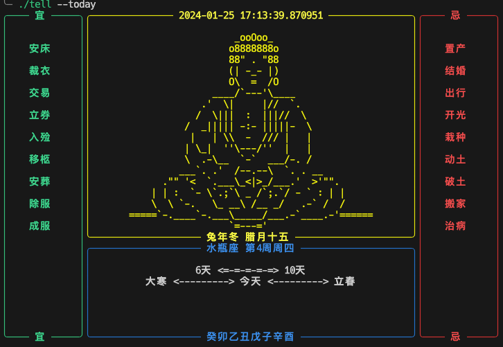

# Fortune-tellers

This is a Python project that uses the `rich` library to create a visually appealing command-line interface, displaying various information about the current date, including lunar calendar, solar terms, zodiac signs, and Bazi.

## Dependencies

This project depends on the following Python libraries:

- `json`
- `datetime`
- `requests`
- `rich`

You can install these libraries using the following command:
```
pip install requests rich
```
Usage
First, you need to create an API object:
```python
api = API()
```
Then, you can call the today method to display information about the current date:
```python
api.today()
```
This will display an interface in the command line that includes information about the current date.
Or use
```sh
./tell --today
```
# Classes and Methods
This project includes two classes: `API` and `DateInfo`.

The API class includes a method today that retrieves information about the current date and displays it in the command line.

The DateInfo class includes a method getTodayInfo that retrieves information about the current date from the API and returns a dictionary containing this information.

# Note
This project uses an external API to retrieve date information, so you need **a stable internet connection** to use this project.